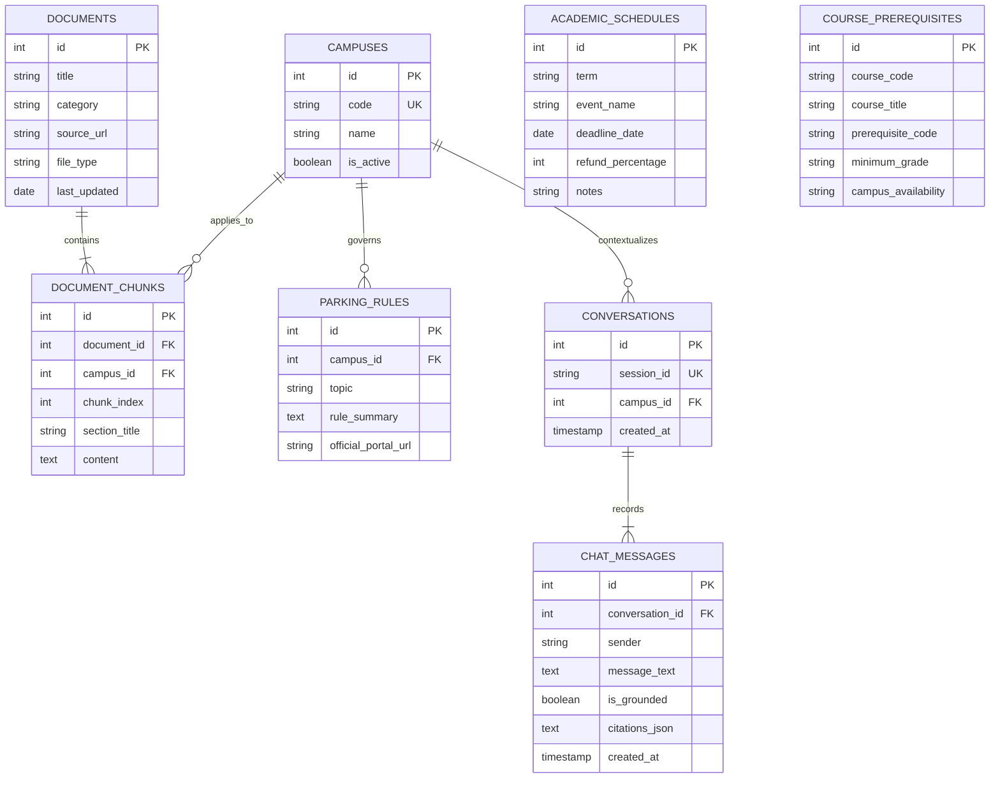

# Entity Relationship Diagram (ERD) - Mermaid.js

This document presents the visual database schema and entity relationships for the PNW Knowledge Chatbot.

```mermaid
erDiagram
    CAMPUSES ||--o{ DOCUMENT_CHUNKS : applies_to
    CAMPUSES ||--o{ PARKING_RULES : governs
    CAMPUSES ||--o{ CONVERSATIONS : contextualizes
    
    DOCUMENTS ||--|{ DOCUMENT_CHUNKS : contains
    
    CONVERSATIONS ||--|{ CHAT_MESSAGES : records

    CAMPUSES {
        int id PK
        string code UK
        string name
        boolean is_active
    }

    DOCUMENTS {
        int id PK
        string title
        string category
        string source_url
        string file_type
        date last_updated
    }

    DOCUMENT_CHUNKS {
        int id PK
        int document_id FK
        int campus_id FK
        int chunk_index
        string section_title
        text content
    }

    ACADEMIC_SCHEDULES {
        int id PK
        string term
        string event_name
        date deadline_date
        int refund_percentage
        string notes
    }

    COURSE_PREREQUISITES {
        int id PK
        string course_code
        string course_title
        string prerequisite_code
        string minimum_grade
        string campus_availability
    }

    PARKING_RULES {
        int id PK
        int campus_id FK
        string topic
        text rule_summary
        string official_portal_url
    }

    CONVERSATIONS {
        int id PK
        string session_id UK
        int campus_id FK
        timestamp created_at
    }

    CHAT_MESSAGES {
        int id PK
        int conversation_id FK
        string sender
        text message_text
        boolean is_grounded
        text citations_json
        timestamp created_at
    }
```
